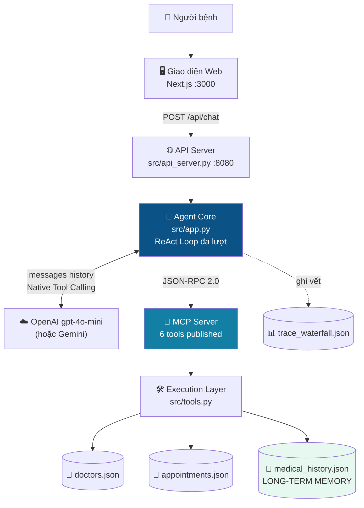
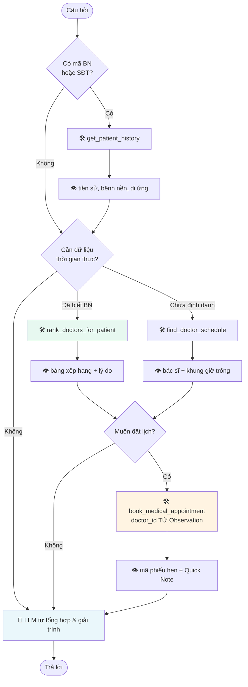

# 🏫 BÀI LAB 3: CHATBOT VS REACT AGENT — TỪ LÝ THUYẾT ĐẾN THỰC THI (MCP ENHANCED)

> **Mã bài học:** `DAY03-REACT-AGENT`  
> **Hình thức thực hiện:** **CÁ NHÂN** *(Mỗi học viên tự làm và tự nộp 1 bài cá nhân)*  
> **Quy chuẩn nộp bài:** Học viên Fork Repo này về GitHub cá nhân và đổi tên theo đúng cú pháp:  
> 📌 **`K4-DAY03-HoVaTen-MSSV`** *(Ví dụ: `K4-DAY03-NguyenVanA-SV2026001`)*  

---

## 🩺 BÀI LÀM CỦA HỌC VIÊN — TRỢ LÝ TƯ VẤN SỨC KHỎE VINMEC

> **Học viên:** Nguyễn Sơn Giang — **MSSV:** 2A202602747
> **Đề tài:** Trợ lý Tư vấn Sức khỏe Vinmec *(Gợi ý 4.3 — Dịch vụ Khách hàng & Y tế)*
> **LLM nghiệm thu:** OpenAI `gpt-4o-mini` (Native Function Calling) — *hỗ trợ sẵn cả Google Gemini*
> **Báo cáo nộp bài:** 👉 [`docs/trace_eval.md`](docs/trace_eval.md)
> **Hướng dẫn trình bày demo:** 🎤 [`docs/DEMO_GUIDE.md`](docs/DEMO_GUIDE.md)

### Bài toán
Người bệnh thường **không biết mình cần khám chuyên khoa nào**, chỉ mô tả triệu chứng. Agent phải tự suy ra chuyên khoa, tra cứu bác sĩ còn trống lịch, rồi giữ chỗ một suất khám — trong cùng một lượt hội thoại.

Ngoài ra, Agent có **bộ nhớ dài hạn** (hồ sơ bệnh án điện tử) để nhớ bệnh nhân đã khám gì với ai, từ đó **gợi ý bác sĩ phù hợp nhất kèm lý do** và **gửi kèm Quick Note tóm tắt bệnh sử cho bác sĩ** trước giờ khám.

### Sáu công cụ công bố qua MCP Server

| Tool | Vai trò | Tham số bắt buộc |
| :--- | :--- | :--- |
| `get_patient_history` | 🧠 **Bộ nhớ dài hạn** — tiền sử khám, bệnh mạn tính, dị ứng thuốc | *(`patient_id` hoặc `phone`)* |
| `find_doctor_schedule` | 🔍 **Tra cứu** bác sĩ & khung giờ trống (theo chuyên khoa *hoặc* triệu chứng) | *(linh hoạt)* |
| `rank_doctors_for_patient` | 🏆 **Xếp hạng có giải trình** — chấm điểm bác sĩ theo tiền sử, kèm lý do | `patient_id` |
| `book_medical_appointment` | 📅 **Đặt lịch** khám, khóa khung giờ, đính kèm Quick Note cho bác sĩ | `doctor_id`, `date`, `time_slot`, `patient_name` |
| `list_my_appointments` | 📋 **Tra lịch hẹn** đang giữ chỗ của người bệnh | *(`patient_id` hoặc `patient_phone`)* |
| `cancel_appointment` | ❌ **Hủy lịch** và trả khung giờ về lịch trống | `booking_id` |

> 🛡️ **Quy tắc xác nhận trước khi giữ chỗ:** Agent **không tự chọn khung giờ** thay người bệnh.
> Nếu người bệnh chỉ nói "đặt lịch giúp tôi" mà chưa nêu giờ, Agent trình bày các khung còn trống
> rồi **hỏi lại** — giống cơ chế *accept/reject* của coding agent. Chỉ khi người bệnh chốt rõ giờ
> (hoặc ủy quyền "giờ nào cũng được") thì Agent mới gọi `book_medical_appointment`.
>
> 🔁 **Đổi lịch là thao tác hai bước:** đặt lịch mới → hủy lịch cũ, để người bệnh không bị giữ hai chỗ
> và khung giờ cũ được trả lại cho người khác.

### Kiến trúc hệ thống



### Vòng lặp ReAct



### Bộ nhớ dài hạn hoạt động thế nào

`data/medical_history.json` lưu hồ sơ 5 bệnh nhân mô phỏng. Khi người bệnh cung cấp mã (dạng `BN2024001`), Agent truy xuất tiền sử trước khi tư vấn. Kết quả: **cùng chuyên khoa nhưng hai bệnh nhân khác nhau nhận hai gợi ý bác sĩ khác nhau**, vì hệ thống ưu tiên bác sĩ đã từng điều trị cho chính họ.

Thang điểm xếp hạng (tối đa 100): đã điều trị cho bệnh nhân này `+40` · số lần khám trước `+15/lần, trần 30` · khớp bệnh mạn tính `+20` · thâm niên `+0…15` · độ sớm lịch trống `+0…10`.

> ⚕️ **Ranh giới chuyên môn:** Agent chỉ **tóm tắt** tiền sử đã được bác sĩ ghi nhận và gợi ý bác sĩ theo chuyên khoa.
> Agent **không chẩn đoán bệnh mới, không kê đơn thuốc**. Dữ liệu trong `data/` là **mô phỏng phục vụ bài lab**, không phải dữ liệu y tế thật.

### Thử nhanh bộ nhớ dài hạn

```text
Tôi là bệnh nhân BN2024001, dạo này đau vùng thượng vị giống đợt trước.
Bạn xem lại giúp tôi trước đây đã khám những gì?

Tôi là BN2024002, bị ợ chua trở lại. Xem bệnh sử rồi chọn giúp bác sĩ
phù hợp nhất và đặt lịch sớm nhất, giải thích vì sao chọn bác sĩ đó.
```

### 🖥️ Chạy bản demo có giao diện web (khuyến nghị khi trình bày)

```powershell
# Lần đầu: cài thư viện cho giao diện
cd web; npm install; cd ..

# Khởi động cả API Agent (cổng 8080) + giao diện web (cổng 3000)
.\start_demo.ps1              # dùng LLM thật theo .env
.\start_demo.ps1 -Mock        # chạy Mock offline, không tốn API quota
```

Mở `http://localhost:3000`. Kịch bản demo gợi ý:

1. Chọn hồ sơ **Tran Thi Binh (BN2024002)** ở thanh bên → thấy chip bệnh mạn tính GERD.
2. Hỏi: *"Tôi bị ợ chua trở lại, chọn giúp tôi bác sĩ phù hợp nhất và giải thích vì sao"*.
3. Quan sát **Tool Trace** hiện từng bước `get_patient_history → rank_doctors_for_patient → final_answer`.
4. Thẻ bác sĩ hiển thị **điểm phù hợp**, nhãn **"Bác sĩ quen"** và lý do xếp hạng.
5. Chọn khung giờ → **Xác nhận đặt lịch** → hộp thoại hiện mã phiếu hẹn kèm **Quick Note** gửi bác sĩ.
6. Bấm **Trace log** để xem toàn bộ JSON chuỗi Thought → Action → Observation.

> 💡 Nếu muốn chạy riêng từng phần: `python src/api_server.py` (API, cổng 8080) và `cd web; npm run dev` (giao diện, cổng 3000).

### ⌨️ Các lệnh dòng lệnh

```bash
python src/mcp_server.py        # Kiểm thử độc lập MCP Server (Checkpoint 2)
python src/app.py --all         # Chạy toàn bộ Test Cases nghiệm thu + xuất trace log
python src/app.py --interactive # Trò chuyện trực tiếp với Agent trong terminal
python src/app.py --compare     # So sánh Chatbot (Cấp 2) vs ReAct Agent (Cấp 3)

python tests/test_tools.py      # 112 phép kiểm thử tầng công cụ (offline, miễn phí)
python tests/verify_trace.py    # Kiểm định chất lượng trace log sau khi chạy --all
python tests/reset_data.py      # Khôi phục lịch bác sĩ & sổ phiếu hẹn về nguyên trạng
```

### 🔄 Chuyển đổi LLM Provider

Dự án hỗ trợ **3 provider**, đổi bằng cách sửa `.env` — không cần sửa code:

| Provider | Cấu hình trong `.env` | Ghi chú |
| :--- | :--- | :--- |
| **OpenAI** *(đang dùng)* | `LLM_PROVIDER=openai`<br/>`OPENAI_API_KEY=sk-...`<br/>`LLM_MODEL=gpt-4o-mini` | Trả phí, hạn mức thoáng, phù hợp chạy test suite liên tục |
| **Google Gemini** | `LLM_PROVIDER=gemini`<br/>`GEMINI_API_KEY=AIza...`<br/>`LLM_MODEL=gemini-3.6-flash` | Free tier ~5 request/phút → cần `TESTCASE_DELAY` lớn |
| **Mock offline** | `LLM_PROVIDER=mock` | Miễn phí, không cần mạng, dùng khi gỡ lỗi |

> ⚠️ **Lưu ý về hạn mức API:** Free tier Gemini giới hạn ~5 request/phút, nên khi dùng Gemini hãy đặt
> `TESTCASE_DELAY=30` trở lên. Với OpenAI có thể để `TESTCASE_DELAY=3`. Cả hai provider đều đã có
> cơ chế **retry với exponential backoff** khi gặp lỗi `429`.
>
> 🔐 **Bảo mật:** `.env` đã nằm trong `.gitignore` nên API key không bị đẩy lên GitHub.

> 🔄 **Lưu ý về dữ liệu:** Tool `book_medical_appointment` ghi thật xuống `data/appointments.json` và **khóa
> khung giờ đã đặt**. Muốn chạy lại test suite từ trạng thái sạch, khôi phục 2 file trong `data/` về bản gốc
> (`git checkout -- data/`).

### Cấu trúc bổ sung so với starter

```text
├── 📁 data/                      <-- 🗄️ Tầng dữ liệu tách riêng (Data Access Layer)
│   ├── 📄 doctors.json           <-- 12 bác sĩ / 8 chuyên khoa / 38 ánh xạ triệu chứng → khoa
│   ├── 📄 appointments.json      <-- Sổ phiếu hẹn, Agent ghi bổ sung khi đặt lịch thành công
│   └── 📄 medical_history.json   <-- 🧠 LONG-TERM MEMORY: hồ sơ bệnh án 8 bệnh nhân mô phỏng
│
├── 📁 web/                       <-- 🖥️ GIAO DIỆN WEB (Next.js + React)
│   ├── 📄 app/page.tsx           <-- Trang chat, tool trace, thẻ bác sĩ, phiếu hẹn
│   └── 📄 app/globals.css        <-- Hệ thống thiết kế (màu, bố cục, responsive)
│
├── 📁 tests/                     <-- 🧪 KIỂM THỬ TỰ ĐỘNG
│   ├── 📄 test_tools.py          <-- 90 phép kiểm thử tầng công cụ & MCP (offline)
│   ├── 📄 verify_trace.py        <-- Kiểm định chất lượng Waterfall Trace Log
│   └── 📄 reset_data.py          <-- Khôi phục dữ liệu mô phỏng về nguyên trạng
│
├── 📄 src/api_server.py          <-- 🌐 HTTP API nối giao diện web với Agent
└── 📄 start_demo.ps1             <-- 🚀 Khởi động API + giao diện bằng một lệnh
```

---

## ⚡ 1. QUICKSTART — CÀI ĐẶT MÔI TRƯỜNG & CHẠY THỬ (3 PHÚT)

> 🐍 **Yêu cầu môi trường Python:** **Python 3.10 – 3.12** *(Tránh Python 3.9 do thiếu type hinting hiện đại và Python 3.13 do nhiều thư viện AI chưa hỗ trợ pre-built wheel)*.

Thực hiện 3 bước lệnh Terminal thiết thực ngay khi clone repo về máy:

### Bước 1: Clone Repo & Tạo môi trường ảo
```bash
git clone https://github.com/<tai_khoan_cua_ban>/K4-DAY03-HoVaTen-MSSV.git
cd K4-DAY03-HoVaTen-MSSV

python -m venv .venv
# Trên Windows PowerShell:
.venv\Scripts\Activate.ps1
# Trên macOS / Linux / Bash / Zsh:
source .venv/bin/activate
```

### Bước 2: Cài đặt thư viện & Tạo file cấu hình môi trường
```bash
pip install -r requirements.txt
# Trên Windows CMD/PowerShell:
copy .env.example .env
copy config\test_cases.example.json config\test_cases.json
# Trên macOS / Linux:
cp .env.example .env
cp config/test_cases.example.json config/test_cases.json
```

### Bước 3: Chạy thử Baseline kiểm tra môi trường
```bash
python src/app.py --all
```

**Kỳ vọng Output màn hình:**
```text
✅ [MOCK OFFLINE MODE PASS]: Môi trường đã sẵn sàng! 
📊 [KẾT QUẢ TEST SUITE]: 2 Đã chạy (TC01, TC02 mẫu) | 3 Đang chờ viết câu hỏi (TODO)
```

> 🔑 **QUY ĐỊNH BẮT BUỘC VỀ API KEY VÀ NỘP BÀI (SUBMISSION REQUIREMENT):**  
> 
> 1. **Giai đoạn gõ code & debug (Miễn phí 0đ):** Hệ thống mặc định chạy `MockOfflineProvider` giúp bạn thực hành gõ code, kiểm thử logic ban đầu hoàn toàn miễn phí, không tốn token, không lo nghẽn mạng.  
> 2. **Giai đoạn NỘP BÀI CHÍNH THỨC (Bắt buộc dùng LLM thật):** Khi chạy nghiệm thu để lấy dữ liệu dán vào báo cáo [`docs/trace_eval.md`](docs/trace_eval.md) nộp bài, **học viên BẮT BUỘC phải mở file `.env` điền `GEMINI_API_KEY` (hoặc `OPENAI_API_KEY`)** để Agent giao tiếp với mô hình LLM thật.  
> 
> ⚠️ *Lưu ý:* Bài nộp chỉ chạy trên Mock Provider mà không kết nối LLM API thật sẽ bị trừ điểm phần nghiệm thu thực tế (Tiêu chí 2 & Tiêu chí 3 trong Rubric).

---

## 🎯 2. BỨC TRANH TỔNG THỂ & MỤC TIÊU DÀI HẠN (NORTH STAR GOAL)

Mục tiêu cốt lõi của Bài Lab này là giúp học viên tự tay phát triển một **Trợ lý Tác tử ReAct (ReAct Agent)** hoàn chỉnh.

Thay vì chỉ sinh văn bản hội thoại đơn thuần như Chatbot cơ bản, tác tử (Agent) của bạn sẽ có khả năng:
1. **Tự suy luận và chọn công cụ:** Chủ động kích hoạt vòng lặp ReAct (`Thought -> Action -> Observation`) qua giao thức **Model Context Protocol (MCP)** để truy vấn dữ liệu thực tế.
2. **Tổng hợp câu trả lời chính xác:** Sử dụng dữ liệu thực tế từ Tool trả về để trả lời sinh viên, tránh hiện tượng ảo giác (Hallucination).
3. **Trích xuất bằng chứng (Trace Log):** Ghi lại file vết `docs/trace_waterfall.json` chứng minh chuỗi suy luận từng bước của Agent.

> 🌐 **GIAO THỨC MODEL CONTEXT PROTOCOL (MCP):**  
> Mã nguồn [`src/mcp_server.py`](src/mcp_server.py) mô phỏng kiến trúc MCP Server chuẩn (giao tiếp Client-Server độc lập qua giao thức JSON-RPC 2.0). Agent Core ([`src/app.py`](src/app.py)) đóng vai trò MCP Client gửi yêu cầu thực thi Tool tới MCP Server.

---

## 🗺️ 3. LUỒNG THỰC HÀNH TINH GIẢN 3 BƯỚC (DOCUMENTATION FLOW)

Học viên làm bài lần lượt theo đúng luồng 3 bước tinh giản dưới đây:

| Bước | Tài liệu / Hành động | Nội dung thực hiện |
| :---: | :--- | :--- |
| **Bước 1** | 📄 **`README.md`** *(Hiện tại)* | Nắm quy chế, chạy Quickstart verify môi trường offline miễn phí. |
| **Bước 2** | 🎓 **`docs/CODELAB.md`** | **[TRỌNG TÂM]** Chọn bài toán (Tham khảo gợi ý tại [docs/DANH_SACH_DE_TAI.md](docs/DANH_SACH_DE_TAI.md)) ➔ Phân tích Agentic Fit ➔ Điền `GEMINI_API_KEY` ➔ Code từng task theo checklist. |
| **Bước 3** | 📊 **`docs/trace_eval.md`** | Chạy test suite với API thật, xuất trace log, hoàn thiện báo cáo thu hoạch duy nhất và push repo nộp bài. |

---

## ⏱️ 4. PHÂN BỔ THỜI GIAN (180 PHÚT LÀM BÀI)

* **Phần 1 (45 phút):** Agentic Fit & Tool Schemas (Đánh giá 4 tiêu chí Fit & Khai báo Tool Schema chuẩn JSON Schema)
* **Phần 2 (60 phút):** ReAct Loop & MCP Integration (Viết hàm MCP Server & Vòng lặp Thought -> Action -> Observation)
* **Phần 3 (45 phút):** Test Execution & Waterfall Log (Cắm API Key thật, chạy 5 Test Cases & Xuất file docs/trace_waterfall.json)
* **Phần 4 (30 phút):** Self-Audit & Push GitHub (Tự kiểm tra code, hoàn thiện báo cáo docs/trace_eval.md & push bài nộp lên GitHub cá nhân)

---

## 📂 5. CẤU TRÚC THƯ MỤC DỰ ÁN

```text
📁 K4-Day03-Lab-Chatbot-vs-ReAct-Agent-MCP/
├── 📄 README.md                 <-- ⚡ [BƯỚC 1] Quickstart setup & Cảnh báo quy định API Key
├── 📄 .env.example              <-- 🔑 File cấu hình API Key (Gemini, OpenAI, Anthropic, Mock)
├── 📄 requirements.txt          <-- 📦 Thư viện Python tương thích đa nền tảng
│
├── 📁 config/
│   ├── 📄 test_cases.example.json <-- 🟢 Mẫu Bộ 5 Test Cases (Copy thành test_cases.json)
│   └── 📄 test_cases.json         <-- 🟢 Bộ 5 Test Cases tùy biến theo đề tài của bạn
│
├── 📁 src/                      <-- 💻 MÃ NGUỒN PYTHON
│   ├── 📄 mcp_server.py         <-- 🌐 MCP Server quản lý Tool Registry & JSON-RPC Dispatcher
│   ├── 📄 tools.py              <-- 🛠️ Backend Tool Schemas JSON & Execution Layer
│   ├── 📄 prompts.py            <-- 🛡️ System Prompts cho Chatbot và ReAct Agent
│   ├── 📄 providers.py          <-- 🔌 Multi-Provider LLM Adapter (Gemini/OpenAI/Mock)
│   ├── 📄 app.py                <-- 🚀 MCP Client & Core Agent App ghép nối ReAct Loop & Trace Log
│   └── 📁 ai_levels/            <-- 📚 [REFERENCE ONLY] Code mẫu kiến trúc tham khảo (Không sửa/debug)
│       └── 📄 README.md         <-- ⚠️ Chú thích mã nguồn tham khảo
│
└── 📁 docs/                     <-- 📚 TÀI LIỆU HƯỚNG DẪN CHUẨN VLEARN CODELAB
    ├── 📄 DANH_SACH_DE_TAI.md    <-- 💡 Gợi ý chủ đề theo Lĩnh vực & Đề tài Mở
    ├── 📄 CODELAB.md            <-- 🎓 [BƯỚC 2 - TRỌNG TÂM] Hướng dẫn Codelab thực hành theo checklist
    └── 📄 trace_eval.md          <-- 📊 [BƯỚC 3] File Báo cáo Nộp bài duy nhất (Submission Report Artifact)
```

---

## 💯 6. THANG ĐIỂM ĐÁNH GIÁ (SCORING RUBRIC 100%)

| Tiêu chí | Trọng số | Mô tả chi tiết | Bằng chứng kiểm tra (Artifacts) |
| :--- | :---: | :--- | :--- |
| **1. Agentic Fit & Tool Specs** | **25%** | Phân tích đúng 4 tiêu chí Agentic Fit. Khai báo Tool Schema chuẩn JSON Schema. | Bảng Scoring Matrix (`docs/trace_eval.md`) + `config/test_cases.json`. |
| **2. ReAct Loop & MCP Integration** | **35%** | Vòng lặp ReAct chạy mượt mà qua Native Tool Calling & MCP Server **trên LLM API thật (Gemini/OpenAI)**. | Code trong `src/mcp_server.py` + `src/tools.py` + `src/app.py` + Log API thật. |
| **3. Waterfall Trace & Observation** | **25%** | File log `trace_waterfall.json` trích xuất đầy đủ chuỗi suy luận Thought $\rightarrow$ Action $\rightarrow$ Observation. | File log `docs/trace_waterfall.json` + `docs/trace_eval.md`. |
| **4. Git Repository & Submission** | **15%** | Cấu trúc Repo sạch sẽ, commit chuẩn chỉ và nộp đúng hạn trên LMS VLearn. | Link Repo GitHub cá nhân. |
